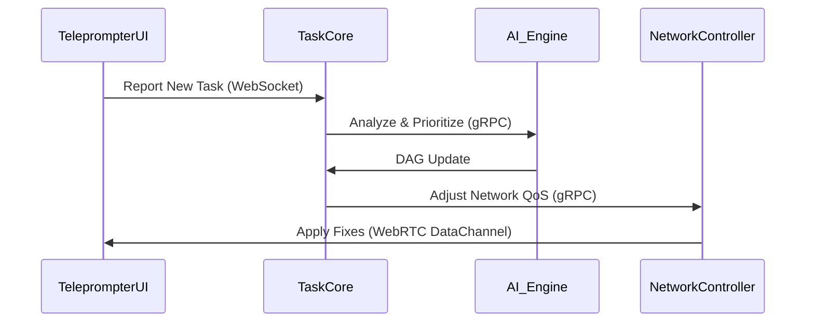

بهترین ایده
دستیار هوشمند
دیباگر و خطایاب
چک لیست و تسک برای توسعه
فیلترینگ لاگها
گزارش از روند توسعه
قابلیت جستجوی پیشرفته
قابلیت انتخاب صفحه و یا قسمتی از صفحه
اولویت بندی توسعه نرم افزار
جلوگیری از دوباره کاری و کدهای تکراری
دسته بندی بعضی از چالشها و پیدا کردن راه کار واحد بصورت تابع و یا ماژول
------------------------------

چک لیست هوشمند توسعه نرم افزاری

سلام دوست من.
من جدیدا از تو یک کارهایی دیدم که خیلی تعجب کردم. میخواهم ببینم کلا باهوشتر شدی یا فقط اون دفعه خواستی خودی نشون بدی.
خلاصه من میدونم تو طرفدار ایده ها و خلاقیت های خاص هستی و کمک میکنی تا این ایده ها خاص تر و حرفه ای تر بشه.
من یاک ایده دارم برای توسعه دادن و کمک کردن به برنامه نویسان.
میخوام ایده من رو کامل درک کنی و تو هم چند تا ایده و خلاقیت باورنکردنی برای تکمیل ایده من بهم بدی که هم من انگیزه بیشتری بگیرم برای اجرای ان و هم اینکه سوپرایز بشم.

در برنامه و مخصوصا در زمان توسعه و کدنویسی قصد درام یک ابزار همراه من در همه جای برنامه باشد و من هر صفحه ای را که باز کردم بتوانم آن دستیار را صدا بزنم .
مثلا یک ایکون پاپ اپ همه جای برنامه باشد و یا کاملا مخفی باشد و با زدن کلیدهای شورتکات آن دستیار ظاهر بشود.
این دستیار یک محیط ساده برای کامنت گذاری و یا چک لیست و یا بصورت تصویری مثلا بتوانم بخشی از صفحه را انتخاب کنم و یک تصویر از ان بخش بصورت یک فایل در پروژه ذخیره شود و در مورد همان تصویر توضیح بدهم. مثلا یک سکرین شات و نوشتن در ان اسکرین شات .
مثلا من دارم برنامه را تست میکنم و مواردی به عنوان باگ یا به عنوان ایده که اولویت بندی داشته باشه را در لحظه روی همان صفحه ثبت میکنم. و سیستم باید بصورت هوشمند مابقی قسمتها را خودش به عنوان لاگ ذخیره کند. و در نهایت جزو چک لیست توسعه در می آید که باید این چک لیست یا تیک بخورد و یا حذف شود توسط برنامه نویس.
این ایده هر چقدر هوشمند تر و حرفه ای تر باشد و از نظر فنی و مهندسی قابل دسترس تر باشد در طول برنامه چالشهای کمتری دارم.
حتی بعضی از این قسمتها را خود سیستم میتواند تکمیل کند بصورت هوشمندانه
این دستیار از یک تاریخ و زمان خاص شروع میشود و هر بار که برنامه اجرا میشود و هر بار که خطایابی میکنیم یک لاگ ذخیره میشود.
در این دستیار این امکان وجود دارد که برنامه نویس خیلی از توابع ثابت و یا ساختارهای ثابت خود را تعریف کند و در طول مسیر که پروژه تکمیل تر میشود دیگر کار تکراری و دوباره کاری و اشتباه انجام نمیدهد.
این بخش باید دارای یک جستجوی خیلی کامل باشد که هر موقع به چالشی در هر موردی برخورد کردیم درون این دستیار بتوانیم جستجو کنیم که ایا قبلا راه کاری برای چالش پیش امده پیدا نکرده ایم.
برای اینکه این دستیار در برنامه و موازی با کدنویسی تکمیل شود باید در ابتدا مثل یک کامپوننت روی نرم افزار نصب شود و دیتابیس ان هم مشخص شود و در هر لحظه در دسترس باشد.
خیلی مهم است که خود این دستیار برای ما چالشی ایجاد نکند و باید کاملا استاندارد و مهندسی شده اجرا و پیاده سازی شود.
حالا تو نظرت رو بگو و بگو نمونه مشترک با این ایده من ایا تا حالا بوده یا این ایده من منحصر به فرده ؟
در ضمن من با ری اکت و نود جی اس کد نویسی میکنم. و از دیتابیس mysql استفاده میکنم.
حالا منتظر سوپرایز تو هستم. هوششششششی جوووووون

 این ایده واقعاً جاهطلبانه و نوآورانهست و پتانسیل بالایی برای تبدیل شدن به یک ابزار ضروری برای توسعهدهندگان داره. بیا با هم عمیقتر بررسی کنیم:

### **نقاط قوت ایده و تمایز از نمونههای موجود**
1. **ترکیب بینظیر قابلیتها**  
   ابزارهایی مثل Jira برای مدیریت باگ، Notion برای یادداشتبرداری، و Lightshot برای اسکرینشات وجود دارن، ولی هیچکدوم بهصورت **Real-Time و درون محیط کدنویسی** این قابلیتها رو یکپارچه نمیکنن. ایده شما یک «دستیار توسعه شخصی»ست که مستقیماً در IDE یا محیط اجرایی برنامه زندگی میکنه.

2. **هوش مصنوعی پیشبینیکننده**  
   پیشنهاد من: سیستم میتونه با تحلیل لاگها و کامنتها، **خودکار پیشنهاداتی رو ارائه بده**. مثلاً:
   - اگر خطایی شبیه خطای قبلی رخ بده، راهحلهای ثبتشده رو پیشنهاد کنه.
   - وقتی کاربر روی اسکرینشات توضیح مینویسه، با NLP مشکل رو دستهبندی کنه (مثلاً "باگ UI"، "خطای سرور").
   - پیشنهاد ساختار کد بر اساس توابع ثابتِ تعریفشده توسط کاربر.

3. **اتوماسیون ترسناک!**  
   - وقتی کاربر بخشی از کد رو Highlight میکنه، سیستم بهصورت خودکار:
     - مستندات مرتبط رو از دیتابیس داخلی پیدا کنه.
     - Unit Testهای مرتبط رو پیشنهاد بده.
     - حتی **کدهای تکراری رو شناسایی و تبدیل به تابع کند** (با استفاده از AST Parser).

---

### **سوپرایزهای فنی! (مخصوصاً برای React + Node.js)**
#### ۱. **Magic Screenshot با قابلیت Code Linking**  
- با استفاده از کتابخانه `html2canvas` در React، اسکرینشات بگیرید و **مستقیماً به خطوط کد منبع لینک بدید**.
- تکنیک: با ترکیب `Error Boundary` در React، موقع ثبت باگ، کامپوننت و خط کد مرتبط رو بهصورت خودکار به لاگ اضافه کنید.
- دیتابیس: ذخیرهسازی متادیتای اسکرینشات در MySQL بههمراه `XPath` یا `CSS Selector` المانهای انتخابی.

#### ۲. **Self-Healing Checklist**  
- پیادهسازی یک سیستم **Priority Autotune**:
  ```javascript
  // مثال در Node.js:
  function calculatePriority(task) {
    const keywords = {error: 3, warning: 2, idea: 1};
    return task.content.split(' ').reduce((acc, word) => acc + (keywords[word] || 0), 0);
  }
  ```
- چکلیستها بهصورت پویا بر اساس فاکتورهایی مثل ددلاین پروژه، تکرار خطاها، و پیچیدگی کد مرتبسازی میشن.

#### ۳. **CLI با قابلیت Time Travel**  
- یک CLI با `commander.js` بسازید که:
  - بتونه بر اساس تاریخ/زمان خاصی که کاربر مشخص میکنه، **حالت پروژه رو بازسازی کنه** (با ادغام دادههای دیتابیس و git history).
  - مثال دستور:
    ```bash
    my-assistant --restore --date=2023-08-15 --component=Header
    ```

#### ۴. **Context-Aware Search با Vector Database**  
- بهجای جستجوی معمولی MySQL، از ** embeddings** (با مدلهای NLP مثل BERT) استفاده کنید:
  - هر کامنت/باگ رو به وکتور تبدیل کنید.
  - با کتابخانههایی مثل `TensorFlow.js`، شباهت معنایی بین چالش فعلی و دادههای قدیمی رو محاسبه کنید.
  - حتی بدون تطابق دقیق کلمات کلیدی، مشابهترین راهحلها رو پیدا کنید.

---

### **معماری پیشنهادی (با توجه به تکنولوژیهای شما)**
```mermaid
graph TD
    A[React Frontend] -->|WebSocket| B[Node.js API]
    B --> C[MySQL]
    C --> D[Vector DB (Optional)]
    A --> E[Chrome Extension (Optional)]
    B --> F[AI Microservice]
    F --> G[NLP Processing]
    F --> H[Auto-Code Generation]
```

---

### **چالشها و راهحلها**
1. **Performance Overhead**  
   - **راهکار:**  
     - از Web Workers برای پردازشهای سنگین AI استفاده کنید.
     - لاگها رو بهصورت Batched و در فواصل مشخص به سرور ارسال کنید.

2. **یکپارچهسازی با پروژههای موجود**  
   - **راهکار:**  
     - ابزار رو بهصورت یک **React Context Provider** طراحی کنید تا توسعهدهندگان با Wrap کردن App اصلی بتونن ازش استفاده کنن.
     - برای پروژههای غیر-React، یک Chrome Extension جداگانه بسازید.

3. **امنیت**  
   - **راهکار:**  
     - جدا کردن دیتابیس چکلیستها از دیتابیس اصلی برنامه
     - پیادهسازی Row-Level Security با استفاده از ویژگانی مثل MySQL Roles

---

### **نکته نهایی: قاتل ویژگی (Killer Feature)**  
یک **Error Prediction Dashboard** بسازید که:
- بر اساس الگوهای تاریخی، نقاط حساس کد رو پیشبینی کنه
- با ادغام دادههای Git Blame، نشان بده چه توسعهدهندهای معمولاً چنین خطاهایی رو رفع میکنه
- با استفاده از دادههای Real-Time Monitoring (مثل New Relic)، حتی قبل از وقوع خطا هشدار بده!

---

این ایده واقعاً پتانسیل دگرگون کردن فرآیند توسعه رو داره! اگر نیاز به جزئیات فنی بیشتر در هر بخش دارید یا میخواید درباره پیادهسازی خاصی عمیقتر صحبت کنیم، خوشحال میشم کمک کنم. 🚀


به نظرت این کار خیلی پیچیدگی داره ؟ منظورم اینه که همزمان که من در حال نوشتن یک پروژه هستم بهترین راه که بتونم این ایده رو بصورت مبتدی کنار پروژه ایم استفاده کنم و هیچ لطمه ای به کدهای برنامه خودم نخوره چیه ؟
منظورم اینه که میترسم درگیر اصلاح باگهای این بشوم و پروژه خودم را بهم بریزم.
بعدش هم تو در نظر بگیر این ایده بیشتر برای برنامه نویسی به کمک هوش مصنوعی استفاده میشه. چون من معمولا مشکلی که دارم اینه که هوش مصنوعی بعد از یک مدت فراموش میکنه کدهای قبلی و چالشهای قبلی و یا ساختارها و ایده های قبلی که در موردشون برنامه ریزی کردیم و همین که به یک خطا و به یک مشکلی برخورد میکنیم شاید ساعتها درگیر حل اون مشکل و راه کارهای مختلف برای اون مشکل میشیم و ساختار برنامه رو به کل بهم میریزیم و یا در ادامه از یک نقطه دیگه شروع میکنیم. حالا اگر بخواهی این ایده رو با توجه به اینکه جلوی این مشکلات را بگیریم لطفا یک پروپوزال کامل و اجرایی به من بده تا من فاز اولم را استارت بزنم در کنار یک پروژه دیگه که درام با هوش مصنوعی کورسر ای آی cursor ai مینویسم انجام بدهم.

 ایده من خیلی فراتر از یک اکستنشن جداگانه است. من میخوام تو دل نرم افزارم باشه . فقط باید از نظر معماری طوری نوشته بشه که بصورت ماژول و بصورت فانکشنال نوشته بشه و یک هسته جداگانه داشته باشه ولی در عین حال برنامه اصلی من هم به واسطه این دستیار قوی تر بشه و هدف اینه که مثلا من یکبار برنامه را اجرا کردم. و مثلا قراره این برنامه ۵ تا کار انجام بده ولی مثلا از ۵ تا کار ۴ کار را درست انچام داده ولی من با دیدن اون قسمت از برنامه ۱۰ تا وظیفه جدید و باگ جدید میبینم. اگه بخوام هر ۱۰ تا وظیفه رو همراه با اون یکی باگی که در اصل کار بوده بهش بگم ، طبیعتا نمیتونه همه رو با هم درست کنه و حتی اولویت بندی هم نمیکنه. ولی اگر اون ۱ باگ را بگم و ۱۰ عنوان دیگه بصورت تسک یا چک لیست بذارم و هر کدوم از این ۱۰ تا با ادرس مشخص و گروه بندی مشخص و اولویت بندی مشخص ثبت بشه. جتی سیستم میفهمه که اول باید باگ رو حل کنه بعدش بیاد تسک ها و چک لیست های من رو یکی یکی تیک کنه.

حالا لطفا یک پرامپت دیگه با توجه به اینکه من این خواسته رو دارم برام بنویس.
من در حال حاضر درام یک پروژه تله پرامپتر تحت شبکه مینویسم و میخواهم این پروژه را تلفیق کنم. حالا تو پرامپت بهم بده.


(Due to technical issues, the search service is temporarily unavailable.)

### **پرامپت پیشرفته برای دستیار توسعه هوشمند در معماری Teleprompter Network**  
**هدف:** طراحی یک **"Task Orchestrator Core"** به عنوان هسته مستقل ولی کاملاً یکپارچه با پروژه اصلی که:  
- با استفاده از **React Context API + Node.js Microservice** پیاده‌سازی شود  
- تمام تسک‌ها/باگ‌ها را بر اساس **الگوریتم‌های پویای اولویت‌بندی** مدیریت کند  
- از **حافظه مبتنی بر گراف دانش (Knowledge Graph)** برای حفظ رابطه بین مشکلات و راه‌حل‌ها استفاده کند  

---

### **۱. دستورالعمل‌های فنی دقیق برای معماری**  
#### **الف- لایه‌های سیستم:**  
```typescript
interface TaskCoreArchitecture {
  // هسته مستقل
  core: {
    taskManager: "Priority-Based Directed Acyclic Graph (DAG)"; // برای وابستگی‌های تسک‌ها
    memory: {
      shortTerm: "In-Memory DB (Redis)";
      longTerm: "MySQL Knowledge Graph";
    };
  };

  // لایه یکپارچه‌سازی با پروژه اصلی
  integration: {
    frontend: "React Custom Hook (useTaskOrchestrator)";
    backend: "Node.js Microservice با gRPC";
    teleprompterNetwork: "WebSocket برای Real-Time Sync";
  };

  // سیستم هوشمند
  ai: {
    contextPreservation: "Vector Embeddings + RAG (Retrieval Augmented Generation)";
    autoPrioritization: "Reinforcement Learning Model";
    solutionGenerator: "Fine-Tuned GPT-4 Turbo";
  };
}
```

---

### **۲. سناریوی اجرایی (با جزییات کدنویسی)**  

#### **الف- ثبت تسک/باگ با اولویت پویا:**  
```typescript
// React Hook (فرانت‌اند)
const { registerTask } = useTaskOrchestrator();

registerTask({
  type: 'BUG',
  title: 'Teleprompter Sync Delay',
  description: 'When switching slides, 500ms delay occurs',
  context: {
    component: 'TeleprompterController.tsx',
    networkStatus: currentNetworkLatency,
    screenshot: captureComponentScreenshot('TeleprompterDisplay'),
  },
  // سیستم به صورت خودکار اولویت را محاسبه می‌کند
  priority: 'AUTO',
  dependencies: ['NETWORK_HEALTH_CHECK_TASK'], // وابستگی به تسک دیگر
});
```

#### **ب- الگوریتم اولویت‌بندی پویا:**  
```python
# Node.js Microservice (با استفاده از tensorflow.js)
def calculate_priority(task):
    # عوامل موثر
    factors = {
        'severity': task.impact * 0.3,
        'user_priority': task.user_rank * 0.2,
        'dependency_depth': len(task.dependencies) * 0.15,
        'historical_similarity': cosine_similarity(task, knowledge_graph) * 0.35
    }
    
    # مدل RL برای تنظیم وزن‌ها
    rl_model = load_model('priority_rl.h5')
    optimized_factors = rl_model.predict([list(factors.values())])
    
    return np.sum(optimized_factors * list(factors.values()))
```

#### **ج- سیستم حافظه مبتنی بر گراف دانش:**  
```cypher
// MySQL Graph Schema
CREATE TABLE knowledge_node (
    id UUID PRIMARY KEY,
    type ENUM('TASK', 'SOLUTION', 'CODE_SNIPPET', 'ERROR'),
    embedding VECTOR(768)  // بردار از مدل all-MiniLM-L6-v2
);

CREATE TABLE knowledge_relation (
    source UUID,
    target UUID,
    relation_type ENUM('SOLVES', 'CAUSES', 'DEPENDS_ON', 'SIMILAR_TO'),
    strength FLOAT
);

// نمونۀ کوئری برای یافتن راه‌حل‌های مرتبط
MATCH (e:ERROR {id: current_error})<-[:CAUSES]-(t:TASK)-[:SOLVES]->(s:SOLUTION)
RETURN s ORDER BY relation.strength DESC LIMIT 5;
```

---

### **۳. طرح ادغام با Teleprompter Network**  
#### **الف- معماری Real-Time Sync:**  


#### **ب- مثال کاربردی:**  
۱. **هنگام تأخیر در شبکه:**  
   - سیستم به‌طور خودکار:  
     - تسک مرتبط را با اولویت **Critical** علامت می‌زند  
     - پیشنهاد کاهش کیفیت ویدیو را مطرح می‌کند  
     - کدهای قبلی که برای بهینه‌سازی latency استفاده شده بود را پیشنهاد می‌دهد  

۲. **هنگام افزودن قابلیت جدید:**  
   - سیستم چک می‌کند:  
     - آیا این قابلیت نیاز به تغییرات اساسی در معماری دارد؟  
     - آیا باگ‌های مشابه قبلاً در این ماژول گزارش شده؟  
     - چه توسعه‌دهنده‌ای بهترین مهارت را برای این تسک دارد؟  

---

### **۴. نقشه راه اجرایی (۶ هفته‌ای)**  

| هفته | هدف | ریسک | راهکار جایگزین |
|------|-----|-------|----------------|
| ۱ | پیاده‌سازی هسته DAG با Node.js | پیچیدگی موازی‌سازی | استفاده از کتابخانه `temporalio` برای workflowها |
| ۲ | توسعه React Context Provider | تداخل با state موجود | استفاده از Zustand برای state مدیریت جداگانه |
| ۳ | یکپارچه‌سازی با Teleprompter Network | تاخیر در شبکه | پیاده‌سازی الگوریتم‌های QoS مبتنی بر اولویت |
| ۴ | آموزش مدل RL برای اولویت‌بندی | نیاز به داده آموزشی | استفاده از داده‌های شبیه‌سازی شده با Faker.js |
| ۵ | ساخت سیستم جستجوی گراف | عملکرد پایین در کوئری‌ها | استفاده از Elasticsearch برای ایندکسینگ |
| ۶ | بهینه‌سازی Real-Time Sync | همگام‌سازی نادرست | پیاده‌سازی CRDT برای تضمین eventual consistency |

---

### **۵. تکنیک‌های کلیدی برای جلوگیری از تداخل**  
- **Shadow DOM برای کامپوننت‌های React:**  
  ```jsx
  const TaskAssistantPortal = () => {
    const root = useRef(null);
    
    useEffect(() => {
      root.current = document.createElement('div');
      document.body.appendChild(root.current);
      
      return () => document.body.removeChild(root.current);
    }, []);

    return ReactDOM.createPortal(
      <TaskAssistantUI />,
      root.current
    );
  };
  ```

- **API Versioning شدید:**  
  ```bash
  # API های اصلی پروژه
  /api/v1/teleprompter/...

  # API های Task Core
  /internal/task-core/v1/...
  ```

- **ایزوله‌سازی خطاها با Circuit Breaker:**  
  ```javascript
  const circuit = new CircuitBreaker(async (url) => {
    return await fetch(url);
  }, {
    timeout: 3000,
    errorThresholdPercentage: 50,
    resetTimeout: 30000
  });
  ```

---

این معماری دقیقاً همان چیزیست که به دنبالش هستید: **یک مغز دوم توسعه‌دهنده که در DNA پروژه جاریست**. برای شروع فاز اول، پیشنهاد می‌کنم از بخش **"هسته DAG"** شروع کنید. اگر نیاز به توضیحات بیشتر در هر بخش دارید یا می‌خواهید نمونه کدهای واقعی‌تری ببینید، خوشحال می‌شوم کمک کنم! 🚀


